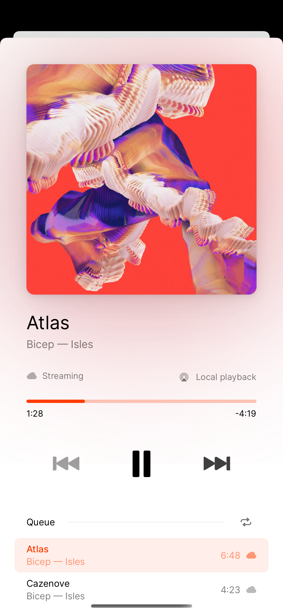
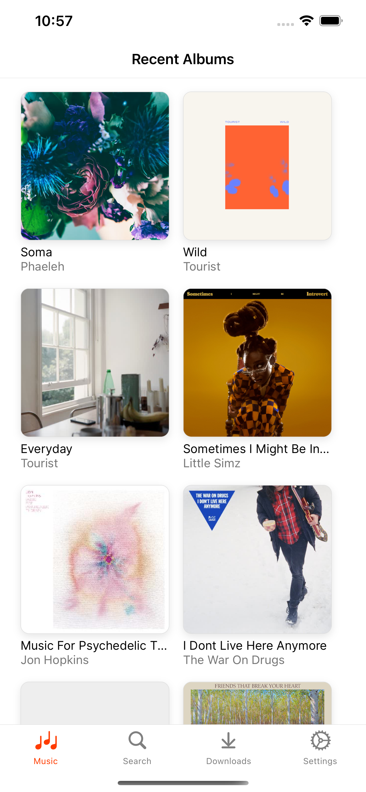
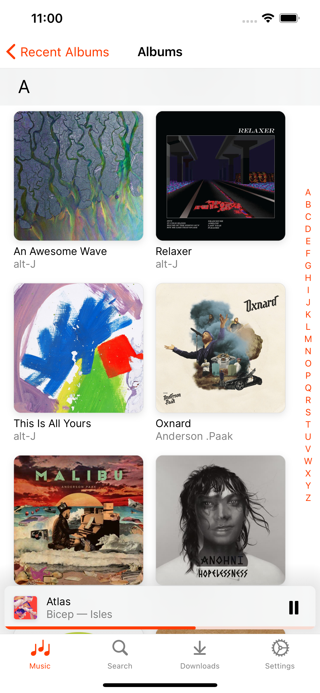
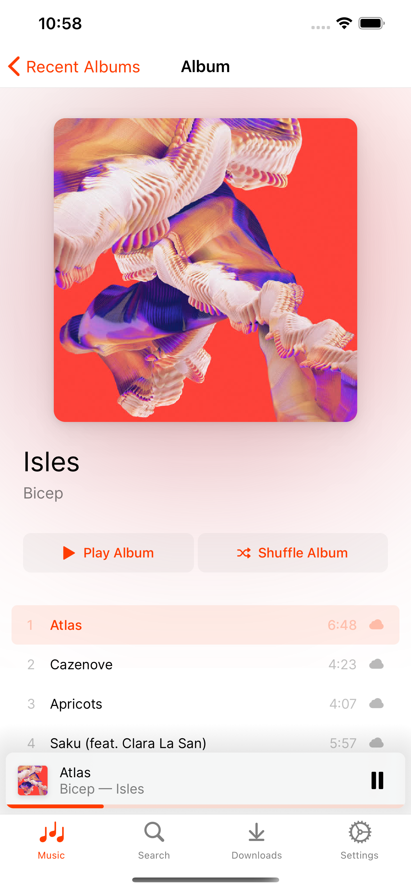
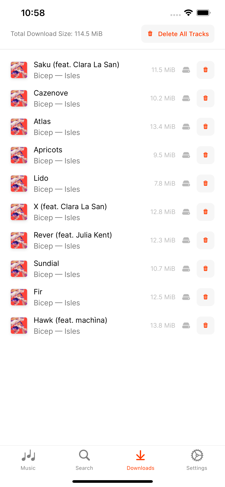
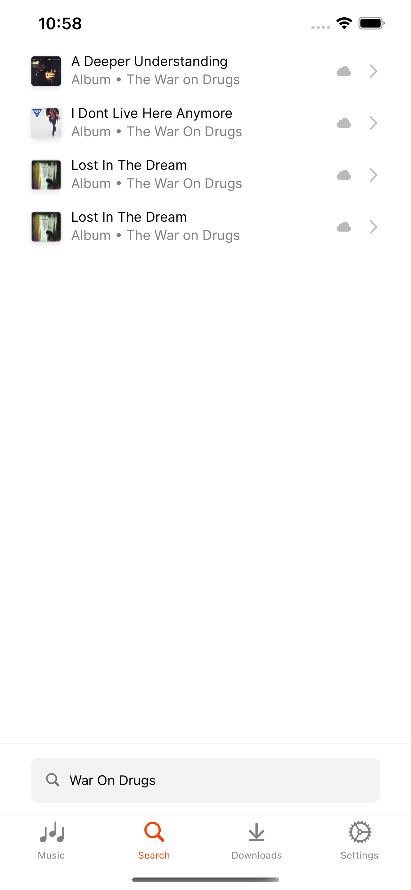

<div align="center">


  
<br />

With Fintunes, you can stream your Jellyfin audio library in full quality. List or search through your favourite tracks, albums and playlists. Stream to speakers and TVs wirelessly via either **AirPlay** or **Chromecast**. **Download** your favourite tracks and play them back, even when you are offline. Available in both a **dark and a light mode**, based on your operating system settings.

<br />
<br />
  
</div>

|||
|-|-|-|
|||

```
npm run ios
npm run android
```

### Production Build
This project is configured using [Fastlane](https://docs.fastlane.tools/), which allows for easy IPA and APK generation. To get started with this, make sure you install Fastlane first either using bundler (see below), or alternatively via e.g. Homebrew ([see supported methods](https://docs.fastlane.tools/getting-started/ios/setup/)).
```
gem install bundler
bundle install -j 6
```
When fastlane is setup, you can run either commands for generating IPA (iOS) or APK (Android) bundles.
```
fastlane ios beta
fastlane android beta
```

